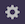

### Introduction

OAS Dashboard service is a [DataTorrent RTS Service](services/#overview) that has been built using Apache Superset. This service packages OAS dashboards, that are enterprise-ready and business intelliget, with a rich set of data visualizations and an easy-to-use interface for exploring and visualizing data.

The [OAS](oas/#introduction) provides the neccesary backend infrastructure for OAS Dashboard Service to query for expected visualizations on the dashboards. OAS Dashboards service is launched as a docker service whereas OAS is launched as an apex service. For more details on services, please refer to [DataTorrent RTS Services](services/#overview)

The OAS Dashboards service help users visualize real time outcomes, historical trends, data KPIs, historical KPIs, real time operational metrics, trends of operator performance, etc. for the following DataTorrent RTS applications:

 - Omni-Channel Fraud Prevention Application
 - Account Take Over Prevention Application

### Pre-requisites

- Docker installation (Version 1.9.1 or greater). You can also install Docker during or after RTS installation and specify the docker host in the installation wizard. For more details, please refer to [Docker Configuration](services/#docker-configuration)

### Accessing OAS Dashboards service

The service is run inside docker containers using Docker images provided by DatTorrent.

These superset services are added as a required service for some RTS applications. You can access the OAS dashboards directly via a proxy URL displayed on the service details page.

Steps to view service details via application page -

1. Click the Monitor tab and open an application.
2. Click the Services drop-down and select the OAS Dashboard service, named like superset-fpa, etc. The Service Details page is displayed.

Steps to view the service details via Service Management Page -

1. Click the Settings icon  located on the upper most right section of the page. 
2. Click on the 'Services' option.
3. Click a certain OAS Dashboards service from the list of all services. 
4. The Service Details page is displayed.

### Managing OAS dashboards

The OAS Dashboards proxy URL redirects user to the list of OAS dashboards which have been imported for the related application. The following menu items are provided to browse through the dashboards and widgets/slices and OAS cluster connection.

| menu item  | action |
|--|--|
| Import dashboards | Allows user to import dashboard files (in .pickle format) into the running Superset service |
| Druid Clusters | Lists all Druid clusters connected to the Superset instance. By default, a connection is OAS is already created |
| Scan New DataSources | Scans new datasources in the Druid clusters and lists them |
| Refresh Druid MetaData | Refreshes the metadata and datasource list of Druid cluster connections |
| Slices | Lists the widgets/charts that have been created in the Superset service. User can add/edit/delete any widget from this list |
| Dashboards | Lists the dashboards created/imported within the Superset service. User can edit/delete/export dashboards from this list |

#### Dashboard controls

There are specific actions that can be performed on the Dashboard. A more descriptive list of these actions can be found below:

| action | description|
|--|--|
| Force refresh the whole dashboard | This action would force a refresh on all widgets on the dashboard |
| Add a new slice to the dashboard | This action enables the user to directly add any of the existing slices/widgets to the currently viewed dashboard |
| Set refresh interval | This action allows user to set a pre-defined refresh frequency that would force refresh of all slices on the dashboard after the selcted interval |
| Active Dashboard filters | This action enables user to apply filters on all slices present inside the dashboard |
| Add CSS | This action allows user to add cutom CSS for the dashboard and save it in a template or use the pre-existing CSS templates |
| Mail Dashboard | This action enables users to email the Dashboard |
| Edit Dashboard properties | This action lets users edit dashboard properties, eg. slices inside dashboard, height, width, etc. |
| Save dashboard | This action will save any temporary changes made to the dashboard |

#### Widget controls

There are specific actions that can be performed on each widget/slice on the dashboard. A more descriptive list of these actions can be found below:

| action | description |
|--|--|
| Move chart | This action allows the user to move around the widget and set their position |
| Force refresh data | This action allows the user to force refresh the data being displayed inside the slice/widget |
| Edit chart | This action allows user to edit the slice properties like vidualization type, dashboard and different parameters |
| Export CSV | This action allows use r to export the chart data in CSV format |
| Explore chart | This action allows users to view/modify the slice query. For more details, pelase refer to [exploring your data](https://superset.incubator.apache.org/tutorial.html#exploring-your-data) |
| Remove | This action removes the slice/widget from the current dashboard view |
