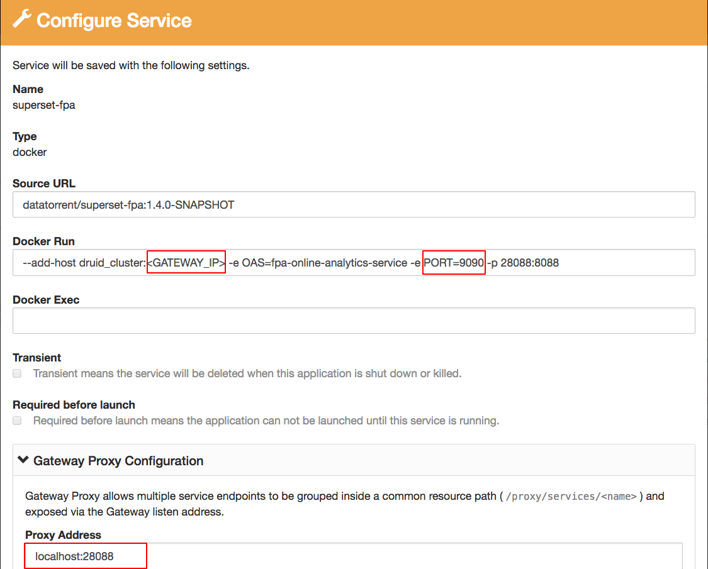

# Quick Start Guide - Omni-Channel Fraud Prevention Application

## Setup Docker and RTS

1. Setup docker daemon host (preferably same as gateway machine). This supplies the docker images for **Online Analytics Service (OAS)**, **OAS Dashboards** which is a customized implementation of Apache Superset, and **CEP Workbench** that is a customized Drools Workbench implementation.
2. Install rts 3.10 bin. In the installation wizard, specify the docker location.

## Launching Fraud Prevention Application

1. Navigate to the **AppFactory page** > **Financial Services** > **Omni-Channel Payment Fraud Prevention.**
2. In the DataTorrent Omni Channel Fraud Prevention Application box, click **import**. 
3. Click on the **View Package** button to view the imported package, and click **download** button to download the package file.  The contents of the `.apa` will be used to generate lookup data.
4. Following steps will generate lookup data, which will be used by the enrichment operators.  Transfer the `.apa` file to the node where hadoop is installed, and execute the following commands on this node.  The last command needs to be executed as the user launching the application, which is `dtadmin` in the example below.

        mkdir fpa_package && cd fpa_package
        unzip ../dt-cep-omni-fraud-prevention-app-1.4.0.apa 
        sudo -u dtadmin java -cp app/*:lib/*:`hadoop classpath` com.datatorrent.cep.transactionGenerator.DumpLookupData lookupdata

5. On the same node as in previous step, get the Geolite Maxmind Database and copy the city database to HDFS using the following commands:

        curl http://geolite.maxmind.com/download/geoip/database/GeoLite2-City.tar.gz -o GeoLite2-City.tar.gz
        tar -zxvf GeoLite2-City.tar.gz 
        sudo -u dtadmin hdfs dfs put GeoLite2-City*/GeoLite2-City.mmdb city.mmdb

6. Create a New Configuration for the OmniChannelFraudPreventationApp by clicking launch dropdown menu next to **OmniChannelFraudPreventionApp** and selecting **+ new configuration** option.
    
      
    
7. Navigate to the newly created configuration and enter the following **Required Properties**.

        * Analytics Output Topic: Analytics
        * Ato Facts Output Topic: Ato
        * Facts Output Topic: Facts
        * Fraud Transactions Output Topic: Fraud
        * Transaction Receiver Topic: Receiver
        * Kafka Broker List: <running kafka broker adddress:port> Ex: node23.morado.com:9092

8. Configure the **CEP Workbench Service**.    

    i. On the configuration page, scroll down.
    
    ii. Select the **drools-workbench** and click **configure**.
    
    iii. Click **save** after specifying the configuration. **Note:** Ensure that the Proxy Address is set correctly.
            
10. Configure the **Online Analytics Service**.
           
    i. Select the **fpa-online-analytics-service** and click **configure**.
    
    ii. Click **save** after specifying the configuration. **Note** :Ensure that the **KafkaBrokers** and the **KafkaTopic** is set correctly.
            
11. Configure the **OAS Dashboards** service.
            
    i. Select **superset-fpa** and click **configure**
    
    ii. Click **save** after specifying the configuration. **Note** : Ensure to set correct druid\_cluster IP and the Proxy Address.
            
12. Configure the Dashboards.
    
    i. Click **configure**.
    
    ii. From the **Select Replacement Applications** drop down, select the corresponding configuration name for both the dashboards.
    
    iii. Click **Save**.
            
13. Save the configuration.

    i. Click **Save.**
    
    ii. Click **launch** to launch the application.
      
## Launch Test Data Generator Application

1. Create **New Configuration** for the OmniChannelFraudPreventationDataGenerator.
2. Go to **Develop** > **Application Packages > + new configuration.**
3. Add **Optional Properties**. Under **Optional Properties**, click **+ add** and add the required optional properties. **Note:** **Kafka** topic of the DataGenerator should be same as the **Transaction Receiver** topic of the Omni Channel Fraud Prevention Application.
4. Click **save**.
5. Click **launch** to launch the Data Generator. 
